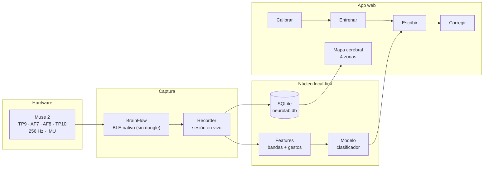
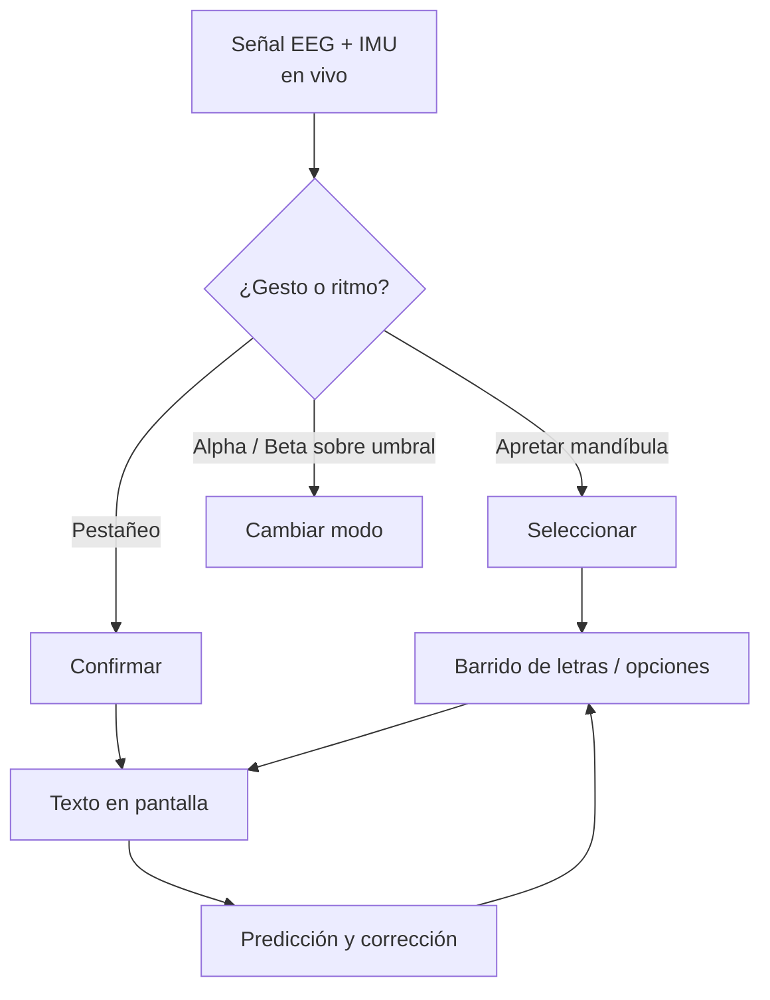

<div align="center">


<br>


**Neurointerfaz local-first que convierte la señal EEG del Muse 2 en un canal de comunicación y escritura asistida.**

*Sin nube. Sin dongle. Todo corre en tu máquina.*

</div>

---

## Qué es

NEUROLAB lee la señal del **Muse 2** (4 electrodos, 256 Hz, IMU) por Bluetooth nativo, la registra en vivo y la usa para manejar una interfaz de escritura sin manos ni voz. La motivación de fondo es clínica: explorar un canal de comunicación para **pacientes críticos que no pueden hablar ni moverse**.

Todo el pipeline —captura, features, modelo, base de datos, interfaz— corre **local**. Nada sale de la máquina.

> [!WARNING]
> **Límite honesto.** El Muse 2 mide 4 puntos (2 frontales, 2 temporales). **No lee pensamiento ni letras imaginadas.** Lee *gestos* (apretar mandíbula, pestañeo) y *ritmos cerebrales* (delta→gamma). Toda la interfaz se construye sobre eso. Es una herramienta experimental de investigación, **no un dispositivo médico** ni una herramienta de diagnóstico.

---

## Arquitectura



## Cómo funciona la escritura asistida



---

## Características

- **BLE nativo** con BrainFlow — sin dongle BLED112, sin apps externas.
- **Dos modos**: Muse real, o **simulación** para probar todo el flujo sin hardware.
- **Registro en vivo** a SQLite con marca de sesión (`Muse real · fs=256 · IMU=sí`).
- **Mapa cerebral** con las 4 zonas del Muse iluminándose según la señal.
- **Calibración por persona** antes de escribir.
- **Umbrales ajustables** por banda para adaptar la sensibilidad de cada gesto/estado.
- Interfaz en el navegador (Chrome / Edge); el recorder corre aparte.

---

## Requisitos

| | |
|---|---|
| **SO** | Windows 10 build 19041 (2004) o superior, o Windows 11 *(requisito de BrainFlow para BT nativo)* |
| **Python** | 3.10+ con *Add to PATH* — `winget install Python.Python.3.12` |
| **Navegador** | Chrome o Edge |
| **Hardware** | Muse 2 encendido + Bluetooth de la PC encendido |

---

## Instalación

```bash
# 1. Descomprimí NEUROLAB en una carpeta fija (ej: C:\NEUROLAB)
# 2. Doble clic en:
INSTALAR.bat
```

`INSTALAR.bat` verifica Python, crea el entorno virtual, baja las librerías y deja el acceso directo **NEUROLAB** en el escritorio. La primera vez tarda unos minutos y necesita internet.

## Uso

```bash
# Doble clic en el acceso directo "NEUROLAB" (o NEUROLAB.bat)
```

Elegís en el menú:

```
[1] Conectar Muse 2 (real)
[2] Modo simulación (sin hardware)
```

La app se abre sola en el navegador. El recorder queda en una ventana negra aparte — para cerrar todo, cerrás esa ventana.

### Conectar el Muse 2 (sin dongle)

1. Prendé el **Bluetooth de la PC**.
2. Prendé el **Muse** (botón hasta que titile).
3. **Cerrá la app Muse / Mind Monitor del celular.** El Muse acepta **una sola conexión a la vez** — este es el error nº1.
4. **No lo emparejes** a mano en Windows. BrainFlow lo escanea y se conecta solo.
5. En el menú → **[1] Conectar Muse 2**, con `config.txt` vacío.

Si tenés **varios Muse cerca**, fijá el tuyo con su MAC en `config.txt`:

```ini
MUSE_MAC=00:55:DA:B0:11:22
```

---

## Estructura del proyecto

```
NEUROLAB/
├── INSTALAR.bat          # setup: entorno + librerías + acceso directo
├── NEUROLAB.bat          # lanzador (menú real / simulación)
├── config.txt            # MUSE_MAC / MUSE_PORT (opcional)
├── LEEME-PRIMERO.txt     # guía rápida
├── data/
│   └── neurolab.db       # registro de señal (SQLite)
├── model/                # modelos entrenados
└── logs/
    └── recorder.log      # logs del recorder
```

---

## Datos y privacidad

Local-first, literal: la señal EEG se registra en `data/neurolab.db` en tu máquina y **no se transmite a ningún servidor**. Los modelos entrenados quedan en `model/`. Vos controlás todo el dato.

## Motivación clínica

Nace en UTI. Un paciente crítico, intubado o con parálisis, pierde el habla y el movimiento pero puede conservar control sobre gestos mínimos (mandíbula, párpados) y patrones de EEG. NEUROLAB apunta a convertir ese margen residual en un canal de "sí / no / selección" y, sobre eso, escritura por barrido — un puente de comunicación cuando no queda otro.

## Roadmap

- [ ] Clasificador más robusto de gestos vs. artefactos.
- [ ] Predicción de palabra (barrido más rápido).
- [ ] Perfiles multi-paciente.
- [ ] Export de sesión para análisis offline.

---

## Disclaimer

Software **experimental** para investigación y prototipado. **No es un dispositivo médico**, no está validado clínicamente y no debe usarse para diagnóstico ni para decisiones de tratamiento.

## Licencia

MIT — ver [`LICENSE`](LICENSE).
